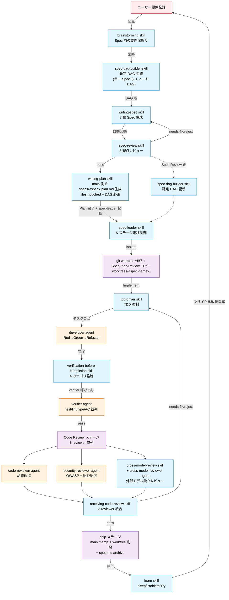
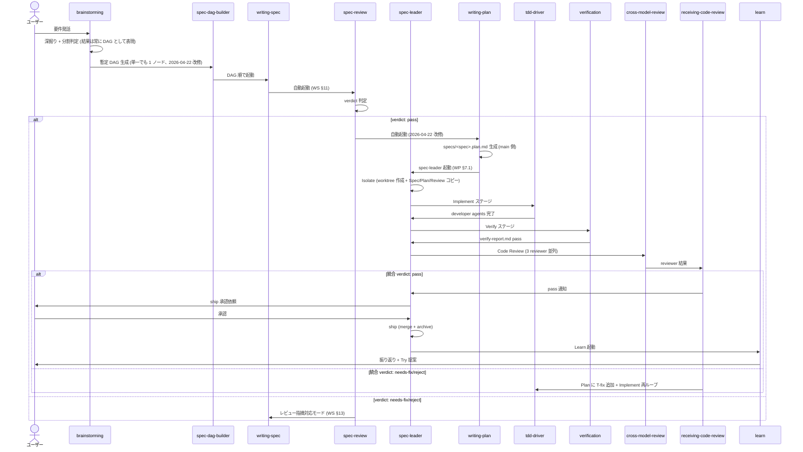
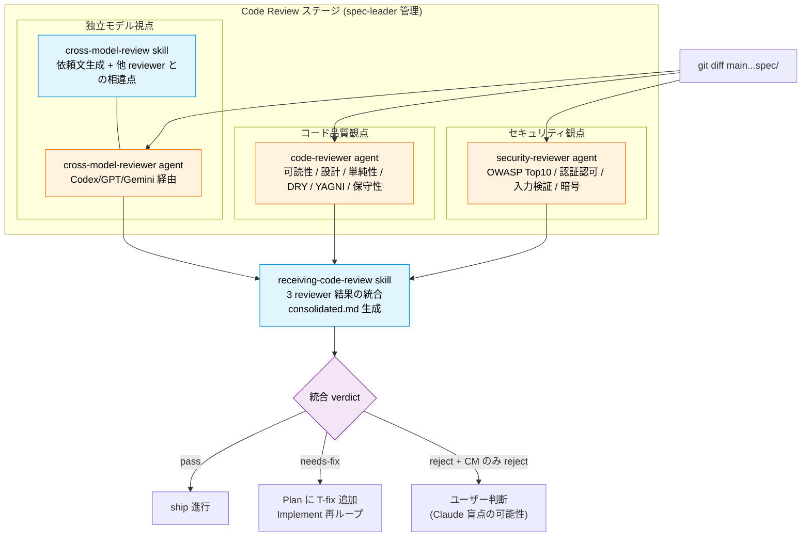

# コンポーネントマップ (skill + agent)

本ドキュメントは Phase 3 時点で実装済みの **skill 11 種 + agent 5 種** の役割・連携・起動トリガー・成果物を整理し、Mermaid 記法で関係を可視化したものです。個別詳細は各 `skills/<name>/SKILL.md` / `agents/<name>.md` を参照してください。

## 1. サマリ

- **skill 11 種**: ワークフロー (`docs/workflow.md`) の 9 ステージをカバー (Brainstorming → DAG 構築 → Spec → Spec Review → Isolate → Plan → Implement → Verify → Code Review → ship → Learn)
- **agent 5 種**: spec-leader の Implement / Verify / Code Review ステージで起動される worker
- **連携方式**: skill 間は自動起動チェーン、agent は spec-leader が起動
- **Phase 5 準備**: spec-leader インタフェースは改修不要、残 agent 3 種 (investigator / spec-reviewer / orchestrator) は Phase 5 対応

## 2. コンポーネント一覧

### 2.1 skill (11 種)

| # | skill | 担当ステージ | 役割 | 自動起動元 |
|---|---|---|---|---|
| 1 | `brainstorming` | Brainstorming | Spec 前の要件深掘り、Spec 分割提案、コードベース精査 | (起点、ユーザーフレーズ) |
| 2 | `spec-dag-builder` | DAG 構築 | 複数 Spec の依存関係解析、Mermaid DAG 生成 (段階的アップデート) | brainstorming (分割時) / spec-review 後 |
| 3 | `writing-spec` | Spec | Brainstorming ノートから 7 章 Spec 生成、brainstorm.md archive 移動、DAG 順処理、レビュー指摘対応モード | brainstorming 完了後 / spec-review 差戻し時 |
| 4 | `spec-review` | Spec Review | 完全性 / 実現可能性 / 整合性 (コードベース走査含む) の 3 観点レビュー、verdict (pass/needs-fix/reject) 生成 | writing-spec 完了後 |
| 5 | `spec-leader` | Isolate〜ship | 5 ステージ遷移制御 (Isolate / Implement / Verify / Code Review / ship)、progress.json / result.json 管理、Phase 5 orchestrator 連携 I/F 確定済 (Plan は前工程で完了済扱い) | writing-plan 完了後 |
| 6 | `writing-plan` | Plan | Spec → specs/<spec-name>.plan.md (main 側配置)、タスク分解 (チェックボックス + files_touched)、DAG 並列判定。他 Spec の Plan 参照可能 | spec-review verdict: pass 後 |
| 7 | `tdd-driver` | Implement | TDD サイクル (Red → Green → Refactor) 強制、テスト存在チェック | spec-leader Plan 完了後 |
| 8 | `verification-before-completion` | Verify | 4 カテゴリ検証 (test / lint / type / 手動 AC) 強制、verify-report.md 生成 | spec-leader Implement 完了後 |
| 9 | `receiving-code-review` | Code Review 後 | reviewer 指摘集約、Plan §2 更新 + T-fix 追加、Implement→Verify→Code Review 循環 (最大 3 回) | spec-leader Code Review で needs-fix/reject 検出時 |
| 10 | `cross-model-review` | Code Review (並列) | 外部モデル (Codex / GPT / Gemini) 経由の独立レビュー、Phase 3 は手動依頼運用 | spec-leader Code Review ステージ (3 reviewer 並列の 1 つ) |
| 11 | `learn` | Learn | progress/result から時間配分 / 手戻り分析、Keep-Problem-Try (具体的パッチ案) 生成 | spec-leader ship 完了後 |

### 2.2 agent (5 種、spec-leader 配下)

| # | agent | 担当ステージ | 役割 | 起動元 |
|---|---|---|---|---|
| 1 | `developer` | Implement | Plan のタスク 1 件を TDD で実装、allowed_files コントラクト遵守 | spec-leader + tdd-driver |
| 2 | `verifier` | Verify | 4 カテゴリを並列実行し verify-report.md 生成 | spec-leader + verification-before-completion |
| 3 | `code-reviewer` | Code Review | コード品質観点 (可読性 / 設計 / 単純性 / DRY / YAGNI / 保守性) レビュー | spec-leader |
| 4 | `security-reviewer` | Code Review | セキュリティ観点 (OWASP Top 10 + 認証認可 + 入力検証) レビュー | spec-leader |
| 5 | `cross-model-reviewer` | Code Review | 外部モデル経由の独立レビュー (Phase 3 は手動依頼) | spec-leader + cross-model-review |

### 2.3 Phase 5 対応 (未実装 3 agent)

| agent | 役割 | 想定起動元 |
|---|---|---|
| `investigator` | コードベース / 依存 / 類似実装調査 | writing-plan (Plan ステージ) / brainstorming (Phase 5 以降) |
| `spec-reviewer` | spec-review の 3 観点 agent 並列化 | spec-review skill (Phase 5 改修時) |
| `orchestrator` | 複数 Spec の DAG 管理、spec-leader 起動、merge 順序制御 | main agent / ユーザー |

## 3. Mermaid 関係図

### 3.1 ワークフロー全体図 (ステージ + skill + agent)



### 3.2 skill 自動起動チェーン (成功ケース)



### 3.3 成果物ファイルの入出力フロー

```mermaid
flowchart LR
    subgraph main["main ブランチ (specs/ 配下)"]
        BrainMD["<spec>.brainstorm.md"]
        SpecMD["<spec>.md"]
        ReviewMD["<spec>.review.md"]
        PlanMDmain["<spec>.plan.md<br/>(2026-04-22 改修: main 側配置)"]
        DagMD["dag.md"]
        ProgJSON["<spec>.progress.json"]
        ResJSON["<spec>.result.json"]
        ArchiveBrain["archive/<spec>.brainstorm.md"]
        ArchiveSpec["archive/<spec>.md"]
        ArchivePlan["archive/<spec>.plan.md"]
        ArchiveReview["archive/<spec>.review.md"]
        LearnMD["archive/<spec>.learn.md"]
    end

    subgraph worktree["worktrees/<spec>/ (spec-leader Isolate 後)"]
        WSpecMD["specs/<spec>.md (コピー)"]
        WReviewMD["specs/<spec>.review.md (コピー)"]
        WPlanMD["plans/<spec>.md (コピー)"]
        SrcFiles["実装コード + テスト"]
        VerifyMD["verify-report.md"]
        ReviewCodeMD["reviews/code.md"]
        ReviewSecMD["reviews/security.md"]
        ReviewXMMD["reviews/cross-model.md"]
        ConsolidMD["reviews/consolidated.md"]
        WProgMD["progress.md (人間可読)"]
    end

    BrainMD -->|writing-spec| SpecMD
    BrainMD -.archive 移動.-> ArchiveBrain
    SpecMD -->|spec-review| ReviewMD
    SpecMD -->|writing-plan (main)| PlanMDmain
    PlanMDmain -.他 Spec が並列参照.-> PlanMDmain

    SpecMD -->|spec-leader Isolate| WSpecMD
    ReviewMD --> WReviewMD
    PlanMDmain --> WPlanMD

    WPlanMD -->|developer agent| SrcFiles
    SrcFiles -->|verifier agent| VerifyMD
    SrcFiles -->|code-reviewer| ReviewCodeMD
    SrcFiles -->|security-reviewer| ReviewSecMD
    SrcFiles -->|cross-model-reviewer| ReviewXMMD
    ReviewCodeMD --> ConsolidMD
    ReviewSecMD --> ConsolidMD
    ReviewXMMD --> ConsolidMD

    SpecMD -.ship archive.-> ArchiveSpec
    PlanMDmain -.ship archive.-> ArchivePlan
    ReviewMD -.ship archive.-> ArchiveReview
    ProgJSON -->|learn 入力| LearnMD
    ResJSON -->|learn 入力| LearnMD

    SL[spec-leader] -.管理.-> ProgJSON
    SL -.管理.-> WProgMD
    SL -.生成.-> ResJSON

    classDef artifact fill:#f0f4c3,stroke:#827717,color:#000
    classDef skill fill:#e1f5ff,stroke:#0288d1,color:#000
    class BrainMD,SpecMD,ReviewMD,PlanMDmain,DagMD,ProgJSON,ResJSON,ArchiveBrain,ArchiveSpec,ArchivePlan,ArchiveReview,LearnMD artifact
    class WSpecMD,WReviewMD,WPlanMD,SrcFiles,VerifyMD,ReviewCodeMD,ReviewSecMD,ReviewXMMD,ConsolidMD,WProgMD artifact
    class SL skill
```

### 3.4 skill × agent 責務マトリクス (Code Review 3 並列体制)



## 4. skill 詳細

各 skill の中核要件を 3-5 行で整理します。

### brainstorming
起点 skill。要件が曖昧な状態で受け取り、質問の往復で Spec を書ける解像度まで深掘り。Spec スコープが大きすぎる場合は分割 (機能 / Release Phase / データ / 層の 4 軸) を提案、コードベースを精査してユーザー質問を絞り込む。出力: `specs/<spec-name>.brainstorm.md`。

### spec-dag-builder
複数 Spec の依存関係を解析し Mermaid DAG + 並列実行グループ表を生成。段階的アップデート方式 (Brainstorming 直後に暫定 → Spec Review 完了後に確定、2 回起動)。循環依存を検出して修正案を提示。出力: `specs/dag.md`。

### writing-spec
Brainstorming ノートから 7 章 Spec (目的 / スコープ / 機能要件 / 非機能要件 / 受け入れ基準 / 非対象 / リスク) を生成。brainstorm.md を `archive/` に移動 (status: archived)、DAG 順で複数 Spec 処理。spec-review 差戻し時は §13 レビュー指摘対応モードで spec.md を修正。

### spec-review
Spec に対して**完全性 / 実現可能性 / 整合性** (コードベース走査込み) の 3 観点で AI レビュー。verdict 判定 (Critical 1 件以上→reject / Major 3 件以上→needs-fix / その他→pass) + 軸別スコア (overall = 0.4×完全 + 0.3×実現 + 0.3×整合)。needs-fix/reject 時は writing-spec を自動再起動。

### spec-leader
Isolate → Implement → Verify → Code Review → ship の **5 ステージ** 遷移制御 (Plan は writing-plan で前工程に完了済、2026-04-22 改修)。progress.json (機械可読、atomic write + 二段検証) / progress.md (人間可読) / result.json (整合性チェック込み、verdict 6 種) を管理。Isolate で main 側 Spec / Plan / Review を worktree にコピー。並列 Implement は sub-worktree 方式 (`options.parallel_implement: true` で opt-in)。再開モード (§14) + 前提条件違反時 result.json (§3.1、plan_path も前提) + 失敗時全停止 (§15) を完備。

### writing-plan
Spec → 技術設計 + タスク分解 (チェックボックス + **files_touched** 必須)。タスク粒度 30-60 分。§5.2 並列判定は「DAG 先祖子孫関係にない」AND「files_touched 積集合空」の 2 条件。共通ファイル編集は T-integrate 集約タスクで最終工程に分離推奨。**main 側で動作** し `specs/<spec-name>.plan.md` を生成 (2026-04-22 改修)。他 Spec の Plan を `specs/*.plan.md` で参照可能。完了後 spec-leader を自動起動。

### tdd-driver
Implement ステージで TDD (Red → Green → Refactor) を強制。テスト存在チェック (Phase 4 で PreToolUse hook 化予定)。developer agent への指示テンプレートで先行テストを明示。テスト後付け / テスト赤のまま進行 / Plan 外タスク実装を禁止。

### verification-before-completion
Verify ステージで全検証 (テスト / Lint / 型 / 手動 AC) を強制。`verify-report.md` に 4 カテゴリ別に実行コマンド + 結果 + ログを記録、verdict: pass/fail。Phase 4 で Stop hook が `verify-report.md` の存在 + verdict: pass を物理ブロック。検証コマンドの推測実行禁止。

### receiving-code-review
3 reviewer の結果を consolidated.md に集約 (ID 規則: `CR-<reviewer>-<severity>-<番号>`、優先度順、重複排除)。Plan に `T-fix-iter-N-M` を追加、frontmatter を plan-revised / revised / review_iteration 更新。実装配置変更を伴う T-fix は **Plan §2 更新をペアで必須化** (§3.2.2、Major-2 再発防止)。Implement→Verify→Code Review ループは最大 3 回、超過で Brainstorming 差戻し提案。

### cross-model-review
外部モデル (Codex / GPT / Gemini / 手動) によるレビュー依頼文を生成、cross-model.md に placeholder 出力。バイアス防止順序 (他 reviewer 結果を先に見せない) を厳守。Phase 3 は手動依頼運用、Phase 3 後期〜4 で自動呼び出し基盤と連携。cross-model のみ reject × 他 pass の場合はユーザー判断 (Claude 盲点の可能性)。

### learn
ship 完了後の振り返り。progress.json / result.json / archive 済 spec.md から時間配分 / 品質ゲート突破率 / 手戻り分析 → Keep-Problem-Try 生成。Try は「対象ファイル / 変更内容 / 期待効果」の 3 要素必須。§8.1 入力データ整合性チェック (spec-leader §7.2 integrity_warnings 連携) で上流 skill のバグ候補を能動的に検出・提案。skill/hook の直接改変は禁止、提案に留める。

## 5. agent 詳細

### developer
Plan のタスク 1 件を TDD で実装。入力: Spec / Plan / 担当タスク ID / **allowed_files** コントラクト。allowed_files 外のファイルを編集する場合、編集開始前 / 編集中 / commit 前の 3 段階自己検査で停止 (越境編集を agent 側でも防御)。完了条件: テスト pass + commit 作成 + Plan チェックボックス `[x]` + allowed_files コントラクト遵守。

### verifier
worktree に対し 4 カテゴリ検証を並列実行 (テスト / Lint / 型 / 手動 AC)。検証コマンドは package.json / Makefile / pyproject.toml / go.mod 等から自動特定、不明ならユーザー確認 (推測実行禁止)。verify-report.md 出力、verdict: pass/fail。

### code-reviewer
コード品質観点 (可読性 / 設計 / 単純性 / YAGNI / DRY / 保守性 / Plan との一致 / プロジェクト規約) でレビュー。**セキュリティは security-reviewer の責務として不侵犯**。出力: reviews/code.md (Critical 1 件以上→reject / Major 3 件以上→needs-fix)。全指摘にファイル:行 + 修正提案を必須。

### security-reviewer
セキュリティ観点 (OWASP Top 10 + 認証認可 + 入力検証 + 機密情報 + 暗号 + CSRF + 依存ライブラリ脆弱性) でレビュー。**コード品質は不侵犯**。保守的判定 (Major 2 件以上で needs-fix)。全指摘に OWASP カテゴリ + 攻撃シナリオ + 修正提案を必須。

### cross-model-reviewer
外部モデルに依頼文を渡して結果を取得、reviews/cross-model.md に記録。バイアス防止のため**他 reviewer 結果を先に見せない**順序を厳守。Phase 3 は手動依頼運用で verdict: PENDING placeholder + 運用メモを生成。他 reviewer のみ pass × cross-model reject は receiving-code-review で「ユーザー判断」扱い。

## 6. 起動トリガー一覧

### 自動起動チェーン

| 前工程 | → | 次工程 | 条件 |
|---|---|---|---|
| brainstorming 完了 | → | spec-dag-builder | 常時 (2026-04-22 改修、単一 Spec も 1 ノード DAG 生成) |
| spec-dag-builder 完了 | → | writing-spec | DAG 順で各 Spec (単一の場合は 1 Spec のみ) |
| writing-spec 完了 | → | spec-review | 常時 (writing-spec §11) |
| spec-review needs-fix/reject | → | writing-spec | §13 レビュー指摘対応モード |
| spec-review pass | → | **writing-plan** | 2026-04-22 改修: Plan が main 側で先行実行 |
| writing-plan 完了 + ユーザー承認 | → | spec-leader | writing-plan §7.1 |
| spec-leader Isolate 完了 | → | tdd-driver + developer | 2026-04-22 改修: Plan はもう前工程で完了済 |
| spec-leader Implement 完了 | → | verification-before-completion + verifier | 常時 |
| spec-leader Verify pass | → | code-reviewer + security-reviewer + cross-model-review | 3 並列 |
| Code Review needs-fix/reject | → | receiving-code-review | 1 人以上 needs-fix/reject |
| receiving-code-review 統合 needs-fix | → | tdd-driver (再ループ) | 最大 3 回 |
| Code Review 統合 pass + ユーザー承認 | → | ship | ユーザー承認必須 |
| spec-leader ship 完了 | → | learn | 常時 |

### 明示フレーズトリガー (主要)

| フレーズ | 起動 |
|---|---|
| 「要件まとめたい」「新しい機能を始めたい」 | brainstorming |
| 「DAG 作って」「依存関係整理して」 | spec-dag-builder |
| 「Spec 書いて」「仕様書起こして」 | writing-spec |
| 「Spec レビューして」 | spec-review |
| 「Isolate 開始して」「<spec> の実装を始めて」 | spec-leader |
| 「Plan 書いて」「タスク分解して」 | writing-plan |
| 「TDD で実装して」 | tdd-driver |
| 「検証して」「verify 実行」 | verification-before-completion |
| 「レビュー指摘を反映して」 | receiving-code-review |
| 「Codex にレビューさせて」 | cross-model-review |
| 「振り返って」「retrospective」 | learn |

## 7. 責務境界マトリクス (重複しないための境界確認)

### 3 reviewer 体制の責務分離

| 観点 | code-reviewer | security-reviewer | cross-model-reviewer |
|---|---|---|---|
| 可読性 / 命名 / コメント | ○ | × | △ (相違点として言及可) |
| 設計 / モジュール分割 / YAGNI / DRY | ○ | × | △ |
| 型設計 (品質視点) | ○ | × | △ |
| 型エラー (攻撃面) | × | ○ (DoS/型混同起因のみ) | △ |
| 認証 / 認可 / 入力検証 | × | ○ | △ |
| OWASP Top 10 | × | ○ | △ |
| 機密情報 / 暗号 / セッション | × | ○ | △ |
| 独立視点 / 他 reviewer 見落とし | × | × | ○ |
| Plan との一致 (iter-3 で強化) | ○ | × | △ |

凡例: ○=主責務 / △=補助 (cross-model のみ他 reviewer の相違点として触れる) / ×=責務外

### Spec Review skill の 3 観点 (単一 skill 内)

| 観点 | 担当 | チェック内容 |
|---|---|---|
| 完全性 | spec-review §4.1 | 7 章充足 / frontmatter / 受け入れ基準 / TBD / リスク |
| 実現可能性 | spec-review §4.2 | 非機能要件達成性 / 技術制約整合 / 時間制約 / 依存関係 |
| 整合性 | spec-review §4.3 | 他 Spec + archive + **コードベース** + dag.md |

## 8. 補足

### genshijin-without-docs

ワークフロー本体とは独立の skill (`skills/genshijin-without-docs/`)。会話返答を圧縮 (トークン約 75% 削減) し、ドキュメント / コードコメント / コミットメッセージ / PR / .md ファイルは通常の丁寧な日本語を維持するモード切替。eval iteration-2 で 6 ケース 100% pass。本ドキュメントの対象範囲 (ワークフロー関連コンポーネント) からは外れますが、プロジェクトで同時に有効化されていることが多い常在 skill です。

### Phase 別の現在地

- **Phase 3 skill 11 種**: 実装 + eval 完了 (2026-04-20〜22)
- **Phase 3 agent 5 種**: 実装 + eval 単体 + iter-3 統合完走 完了 (2026-04-21〜22)
- **§5.3 改善提案 11 件**: 5 バッチで全適用完了 (2026-04-22)
- **Phase 3 残 agent 3 種** (investigator / spec-reviewer / orchestrator): Phase 5 対応
- **Phase 4 hook 自動化**: 未着手 (PreToolUse / Stop / WorktreeCreate / TaskCompleted / SessionStart 等 7 種計画)
- **Phase 5 orchestrator**: 未着手 (複数 Spec 並列管理、spec-leader インタフェースは改修不要確定済)

### 関連ドキュメント

- `docs/workflow.md`: ワークフローの 9 ステージ定義 + 3 層階層
- `docs/glossary.md`: 用語集 (Project Phase / Workflow Stage / Release Phase / Spec)
- `docs/frameworks.md`: 参考フレームワーク一覧と取捨選択方針
- `docs/phase3-completion.md`: Phase 3 完了レポート (eval 結果 + 改善提案適用 + 次 Phase 引き継ぎ)
- `ROADMAP.md`: Phase 1〜6 の段階的構築計画
