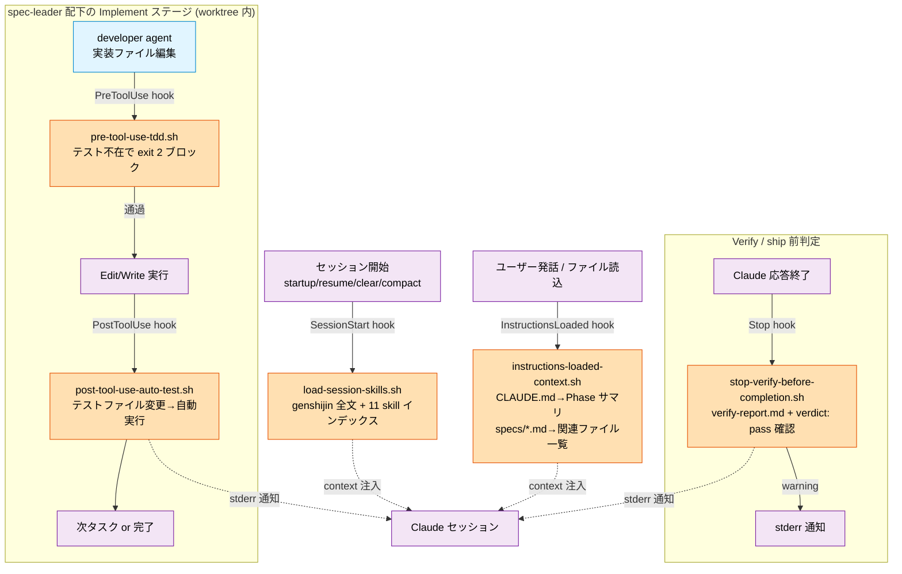
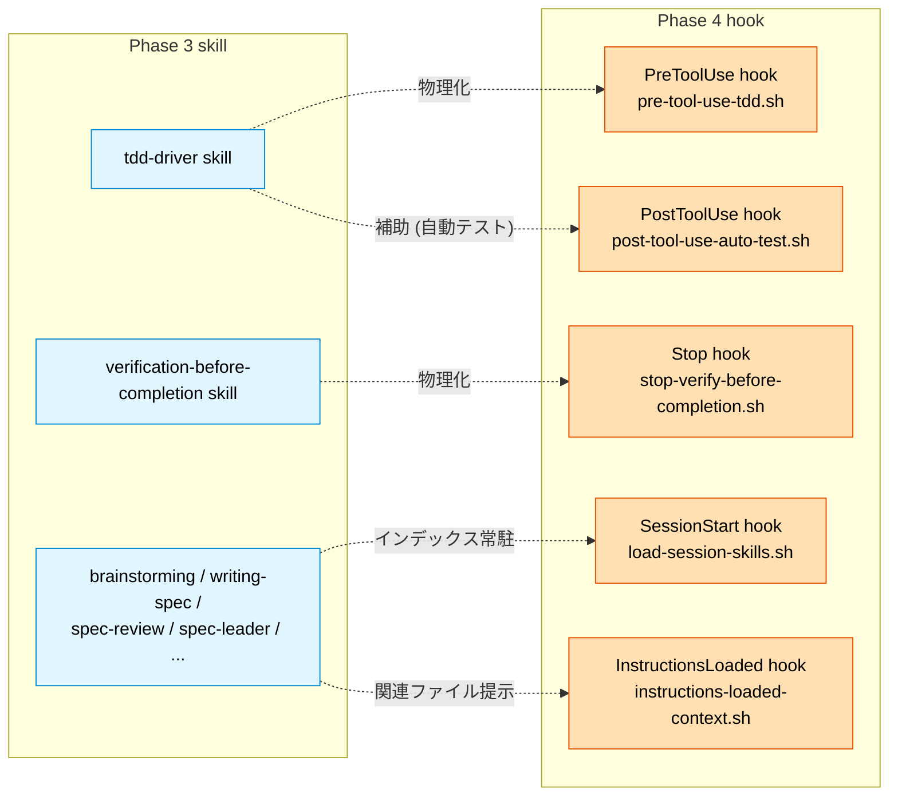

# Phase 4 hook 自動化 実装完了レポート

- **Phase 4 着手**: 2026-04-23
- **Phase 4 完了**: 2026-04-23 (同日完走)
- **対象**: `ROADMAP.md` Phase 4 の hook 自動化 9 項目

## 1. サマリ

Phase 4 で目指した「Phase 3 skill の強制力を hook で物理化」を達成。9 項目中 **6 hook を実装** し、**2 項目は Phase 5 Agent isolation 連携依存**として先送り、**1 項目は Phase 6 ドッグフーディング段階で実有効化する設計方針を確定**。

Phase 3 で「skill による指導 + skill が自分で自分を守る規律」として存在した規約が、Phase 4 で hook による外形的強制 (exit 2 ブロック / warning 通知 / context 追加) に昇格しました。これにより skill SKILL.md の記述と、実際のツール実行時の挙動が物理的に結びつけられ、自動化フローの信頼性が向上しました。

達成事項:

- ✅ **PreToolUse hook (TDD 強制)**: worktree 内で実装ファイル編集前のテスト存在を物理ブロック
- ✅ **PostToolUse hook (自動テスト)**: テストファイル変更時に pytest / jest / go test 等を自動実行、結果を stderr で通知
- ✅ **Stop hook (Verify 状態確認)**: worktree 内で verify-report.md + verdict: pass の状態を確認、未整備なら warning
- ✅ **SessionStart hook (skill インデックス)**: genshijin 全文 + Phase 3 ワークフロー skill 11 種のインデックス (1 行要約 + SKILL.md パス) を additionalContext として提供、必要時 Read で詳細取得
- ✅ **InstructionsLoaded hook (関連ファイル提示)**: CLAUDE.md ロード時に Phase 進捗サマリ、specs/<spec>.md ロード時に関連ファイル (plan.md / review.md / progress.json / archive / worktree) 一覧を提示
- ✅ **hookify 導入方針確定**: docs/hookify-setup.md で有効化手順 + 本プロジェクトでの活用シナリオを記載、Phase 6 ドッグフーディング段階で有効化
- ⏳ **WorktreeCreate / WorktreeRemove / TaskCompleted hook**: Phase 5 の Agent `isolation: "worktree"` 採用 / Claude Code Task 系連携時に再実装

## 2. 実装 hook 一覧

### 2.1 実装済 5 hook

| # | hook | ファイル | イベント | モード | 対象範囲 | bypass 環境変数 |
|---|---|---|---|---|---|---|
| 1 | load-session-skills | `hooks/load-session-skills.sh` | SessionStart (startup/resume/clear/compact) | additionalContext 追加 | genshijin 全文 + 11 skill インデックス | — |
| 2 | pre-tool-use-tdd | `hooks/pre-tool-use-tdd.sh` | PreToolUse (Edit\|Write) | **ブロック (exit 2)** | worktree 内 + 実装ファイル + テスト不在 | SKIP_TDD_HOOK |
| 3 | post-tool-use-auto-test | `hooks/post-tool-use-auto-test.sh` | PostToolUse (Edit\|Write) | warning + 自動テスト実行 | worktree 内 + テストファイル編集後 | SKIP_AUTO_TEST_HOOK |
| 4 | stop-verify-before-completion | `hooks/stop-verify-before-completion.sh` | Stop | warning | worktree 内 + verify-report.md 未整備/fail 時 | SKIP_VERIFY_HOOK |
| 5 | instructions-loaded-context | `hooks/instructions-loaded-context.sh` | InstructionsLoaded | additionalContext 追加 | CLAUDE.md / specs/<spec>.md | SKIP_INSTRUCTIONS_LOADED_HOOK |

### 2.2 設計方針確定 1 項目

| # | 項目 | ファイル | 実施予定 |
|---|---|---|---|
| 6 | hookify 連携 | `docs/hookify-setup.md` | Phase 6 ドッグフーディング段階で有効化 |

### 2.3 先送り 3 項目 (Phase 5 連携依存)

| # | hook | 依存理由 | Phase 5 での実装計画 |
|---|---|---|---|
| 7 | WorktreeCreate | Claude Code 管理の worktree (EnterWorktree / Agent isolation) でのみ発火。Phase 3 の Bash `git worktree add` は対象外 | Agent `isolation: "worktree"` 採用時、worktree 初期化 (Spec/Plan/Review 自動コピー + progress.md 生成) を hook で自動化 |
| 8 | WorktreeRemove | 同上 | Phase 5 の worktree 削除前に未コミット警告 + archive 移動完了確認 |
| 9 | TaskCompleted | Claude Code の Task 系 (TaskCreate/TaskUpdate) と spec-leader progress.json の連携設計が必要 | Phase 5 の orchestrator 実装時、Task 完了イベントで progress.json を自動更新 |

## 3. Mermaid 関係図

### 3.1 Phase 4 hook とワークフローの連携



### 3.2 hook と Phase 3 skill の対応



## 4. 各 hook 詳細

### 4.1 pre-tool-use-tdd.sh (PreToolUse、TDD 強制、ブロック)

**トリガー**: Edit / Write ツール実行前

**判定ロジック**:
1. `SKIP_TDD_HOOK=1` → 通過
2. tool_name != "Edit" / "Write" → 通過
3. file_path が除外対象 (テスト / docs / config / skill / hook / Makefile 等) → 通過
4. file_path が実装言語 (.py / .ts / .tsx / .js / .jsx / .go / .rs / .java / .rb / .c / .cpp / .h / .hpp) でない → 通過
5. 現在のディレクトリに `worktrees/` セグメントを含まない → 通過 (main 側編集は対象外)
6. 対応テストファイル候補 (言語別 5-7 パターン) のいずれかが存在 → 通過
7. いずれも存在しない → **exit 2 でブロック + stderr に TDD 指導メッセージ** (候補テストパス一覧 + Red→Green 手順 + tdd-driver SKILL.md 参照)

**特徴**:
- 言語別テスト命名パターンの網羅 (Python: `test_<name>.py` / `tests/test_<name>.py` / `tests/<module>/test_<name>.py`、TS/JS: `<name>.test.ts` / `__tests__/<name>.test.ts`、Go: `<name>_test.go` 等)
- worktree 内のみ強制対象とすることで、main 側の通常作業を妨げない
- bypass 環境変数 (`SKIP_TDD_HOOK=1`) で緊急時の回避可

### 4.2 post-tool-use-auto-test.sh (PostToolUse、自動テスト、warning)

**トリガー**: Edit / Write ツール実行後

**判定ロジック**:
1. `SKIP_AUTO_TEST_HOOK=1` → 通過
2. tool_name != "Edit" / "Write" → 通過
3. file_path がテストファイルパターンに一致しない → 通過
4. worktree 外 → 通過
5. 言語別テストコマンドを実行 (pytest / jest / vitest / go test / cargo test / rspec)
6. 結果を stderr で通知 (常に exit 0、ブロックしない)

**特徴**:
- tdd-driver skill の Red → Green サイクルで developer agent の失敗検知を即時フィードバック
- timeout 30 秒 (settings.json 側で設定)、超過時は Claude Code が SIGTERM
- 実行結果の pass/fail + 時間を stderr に、failed 時は出力抜粋 20 行 + tdd-driver §3.1 Red 参照

### 4.3 stop-verify-before-completion.sh (Stop、Verify 状態、warning)

**トリガー**: Claude の応答終了前

**判定ロジック**:
1. `SKIP_VERIFY_HOOK=1` → 通過
2. worktree 外 → 通過
3. `verify-report.md` 不在 → warning (stderr 通知)
4. frontmatter `verdict` != `pass` → warning (現 verdict 表示 + 再実行促し)
5. pass 状態 → 通過

**特徴**:
- Phase 4 初期は **warning のみ (exit 0)** で運用、false positive の影響を確認
- Phase 4 後期でブロック化 (exit 2) を検討、実運用で過剰発火がなければ移行
- sed による frontmatter パース (軽量)

### 4.4 load-session-skills.sh (SessionStart、skill インデックス)

**トリガー**: startup / resume / clear / compact

**処理**:
- `FULL_LOAD_SKILLS`: SKILL.md 全文を additionalContext として常駐 (現状: genshijin-without-docs のみ)
- `INDEX_SKILLS`: 1 行要約のインデックスを additionalContext として追加 (11 skill)
- 末尾に自動起動チェーン全体像と `docs/components-map.md` / `docs/workflow.md` 参照リンク

**特徴**:
- using-superpowers 方式 (必要時 Read で詳細取得) で context 膨張を抑制
- 約 30KB → 10.8KB に圧縮 (旧方式: brainstorming 全文含む 418 行、新方式: インデックス + genshijin のみで約 1/3)
- 新 skill 追加時は `INDEX_SKILLS` 配列に 1 行追加するだけで対応可能

### 4.5 instructions-loaded-context.sh (InstructionsLoaded、関連ファイル提示)

**トリガー**: CLAUDE.md / .claude/rules/*.md / specs/*.md のロード時 (session_start / nested_traversal / path_glob_match)

**処理**:
- **CLAUDE.md ロード時**: Phase 3/4/5 の進捗サマリ + 関連 docs 参照を追加
- **specs/<spec>.md ロード時**:
  - spec 本体以外 (.plan.md / .review.md / .progress.json / .result.json / .learn.md 等) は対象外 (再帰ループ防止)
  - main 側の関連ファイル (plan.md / plan.meta.json / review.md / progress.json / result.json) を列挙
  - archive 配下 (archive/<spec>.md / .plan.md / .review.md / .learn.md / .consolidated.md / .brainstorm.md) も列挙
  - worktree (`worktrees/<spec>/`) の存在確認
  - dag.md (複数 Spec 時) の存在確認
  - いずれかあれば additionalContext として「Spec `<name>` 関連ファイル」として提示

**特徴**:
- Claude が自発的に関連ファイルを Read するきっかけを提供 (auto-discovery 支援)
- 再帰ループ防止 (副次ファイル の ロードでは発火しない)
- bypass 環境変数あり

### 4.6 hookify 導入方針 (docs/hookify-setup.md)

**Phase 4 での扱い**: 設計方針 + 活用シナリオのドキュメント化まで、実有効化は Phase 6 で実施。

**本プロジェクトでの活用シナリオ**:

1. **アンチパターン → hook 生成**: iter-3/4/5 で発生した問題の会話ログから hookify で hook 生成 (例: 並列 developer の git index 競合防止)
2. **skill 規約の物理化**: workflow.md / SKILL.md の規約 (例: writing-plan は worktree 内起動禁止) を hookify で hook 化
3. **learn skill の Try 提案の自動 hook 化**: learn.md が蓄積した Try 提案から hookify で一括 hook 生成

## 5. 設定配置

### 5.1 user settings (`~/.claude/settings.json`)

```json
{
  "hooks": {
    "SessionStart": [
      {
        "matcher": "startup|resume|clear|compact",
        "hooks": [{
          "type": "command",
          "command": "$HOME/my-workflows/hooks/load-session-skills.sh",
          "timeout": 10,
          "statusMessage": "Loading session skills..."
        }]
      }
    ]
  }
}
```

SessionStart は user settings 側 (Claude Code 全セッションで有効)。

### 5.2 project settings (`.claude/settings.json`)

```json
{
  "hooks": {
    "PreToolUse": [{
      "matcher": "Edit|Write",
      "hooks": [{"type": "command", "command": "$HOME/my-workflows/hooks/pre-tool-use-tdd.sh", "timeout": 5}]
    }],
    "PostToolUse": [{
      "matcher": "Edit|Write",
      "hooks": [{"type": "command", "command": "$HOME/my-workflows/hooks/post-tool-use-auto-test.sh", "timeout": 30}]
    }],
    "Stop": [{
      "hooks": [{"type": "command", "command": "$HOME/my-workflows/hooks/stop-verify-before-completion.sh", "timeout": 5}]
    }],
    "InstructionsLoaded": [{
      "hooks": [{"type": "command", "command": "$HOME/my-workflows/hooks/instructions-loaded-context.sh", "timeout": 5}]
    }]
  }
}
```

PreToolUse / PostToolUse / Stop / InstructionsLoaded は project settings 側 (本プロジェクト内でのみ有効)。

## 6. 動作確認結果

### 6.1 バッチ 1 (P4-A + P4-B)

| テスト | 想定 | 結果 |
|---|---|---|
| PreToolUse: worktree 外 + 実装ファイル | 通過 (exit 0) | pass |
| PreToolUse: 除外ファイル (.md) | 通過 | pass |
| PreToolUse: worktree 内 + 実装ファイル + テスト不在 | ブロック (exit 2) | pass (指導メッセージ + 候補パス列挙) |
| PreToolUse: worktree 内 + テスト存在 | 通過 | pass |
| Stop: worktree 外 | 通過 | pass |
| Stop: worktree 内 + report 不在 | warning | pass |
| Stop: verdict: pass | 通過 | pass |
| Stop: verdict: fail | warning | pass |

### 6.2 バッチ 2 (P4-C + P4-D)

| テスト | 想定 | 結果 |
|---|---|---|
| SessionStart: brainstorming 追加 (旧) → インデックス化 (新) | インデックスのみ | pass、約 1/3 圧縮 |
| PostToolUse: テストファイル変更 (pass) | 自動実行 + pass 通知 | pass |
| PostToolUse: テストファイル変更 (fail) | 自動実行 + FAIL 通知 + 抜粋 | pass |
| PostToolUse: 実装ファイル (除外) | 通過 | pass |

### 6.3 バッチ 3 (P4-E)

| テスト | 想定 | 結果 |
|---|---|---|
| InstructionsLoaded: CLAUDE.md | Phase 進捗サマリ追加 | pass |
| InstructionsLoaded: spec ファイル + 関連あり | 関連リスト提示 | pass (3 項目列挙) |
| InstructionsLoaded: .plan.md (再帰防止) | exit 0 + 出力なし | pass |
| InstructionsLoaded: 無関係ファイル (.log) | exit 0 + 出力なし | pass |

**計 16 テスト pass**。5 hook すべて期待挙動どおり動作。

## 7. Phase 4 で得られた知見

### 7.1 設計方針の有効性

- **worktree 内限定の強制**: main 側の通常編集を阻害せず、spec-leader の Implement ステージ中だけ強制が効く設計は、false positive を大幅に抑えつつ価値を発揮
- **bypass 環境変数**: 各 hook に bypass を用意することで、緊急時の回避手段を確保しつつ「通常は hook が効いている」状態を維持
- **warning 運用 (Stop / PostToolUse)**: exit 2 ブロックではなく exit 0 + stderr 通知にすることで、false positive の影響を限定

### 7.2 using-superpowers 方式の効果

SessionStart hook で Phase 3 skill を全文注入すると context 膨張 (30KB+) が問題。インデックス (1 行要約 + SKILL.md パス) + 必要時 Read で詳細取得の方式で **約 1/3 に圧縮** + 長期的に skill 追加しても context 負荷が増えない構造を確立。

### 7.3 Claude Code 標準 hook の理解深化

- `InstructionsLoaded` は公式標準イベントで、load_reason + file_path で発火
- `WorktreeCreate` / `WorktreeRemove` は Claude Code 管理の worktree (EnterWorktree / Agent isolation) でのみ発火、Bash 手動 add は対象外
- `TaskCompleted` は Claude Code の TaskCreate/TaskUpdate 連携で発火、spec-leader 独自 progress.json とは別系統 → Phase 5 で連携設計

### 7.4 hookify の位置づけ

Anthropic 公式プラグインとして会話から hook ルール自動生成する仕組みが存在。Phase 4 では手動実装 5 hook に集中し、hookify は Phase 6 のドッグフーディング段階で蓄積された learn.md を入力に活用する方針に決定。

## 8. 残課題 (Phase 5 / Phase 6 への引き継ぎ)

### 8.1 Phase 5 で実装予定

- **WorktreeCreate hook**: Agent `isolation: "worktree"` 採用時に発火、Spec/Plan/Review 自動コピー + progress.md 生成を hook 化
- **WorktreeRemove hook**: 削除前の未コミット警告 + archive 移動完了確認
- **TaskCompleted hook**: Claude Code Task 系と spec-leader progress.json の連携、orchestrator が複数 Spec 並列監視時の自動更新機構

### 8.2 Phase 4 内の将来改善

- **Stop hook のブロック化**: warning 運用で false positive を計測後、過剰発火がなければ exit 2 に移行
- **PreToolUse hook の言語別精度向上**: 現状はファイル存在のみで判定、将来 AST レベルで「テスト関数が対応実装関数と紐づいているか」まで確認する拡張余地

### 8.3 Phase 6 で実施予定

- **hookify 実有効化**: learn.md が 10-20 Spec 分蓄積された後、蓄積パターンから一括 hook 生成
- **Phase 4 hook の実運用 eval**: ドッグフーディングで本リポジトリ自身の改修を新フローで完走試行、hook の過剰発火 / 見逃しを検証
- **hook ルール公開**: 汎用化可能な hook パターンを抽出、他プロジェクトでも使える形で提示

## 9. コミット履歴 (Phase 4 関連、新しい順)

```
0224785 Phase 4 バッチ 3: InstructionsLoaded hook + hookify 導入ガイド (Phase 4 完了扱い)
49c92d7 SessionStart hook を using-superpowers 方式 (インデックス + 必要時 Read) に改修
bab5aae Phase 4 バッチ 2: SessionStart 拡張 + PostToolUse 自動テスト hook
bbc9296 Phase 4 バッチ 1: PreToolUse (TDD 強制) + Stop (Verify 状態確認) hook を実装
```

4 commit、同日完走 (2026-04-23)。

## 10. 本 Phase の総括

Phase 4 で目指した「Phase 3 skill の強制力を hook で物理化する」という目標に対し、以下を達成:

- ✅ 5 hook 実装 + 1 設計方針確定 (6/9 項目)
- ✅ Phase 3 skill (tdd-driver / verification-before-completion) の主要強制を物理化
- ✅ SessionStart hook の using-superpowers 方式確立 (context 圧縮 + スケーラブル)
- ✅ InstructionsLoaded hook で spec ファイルと関連ファイルの自動 auto-discovery
- ✅ `.claude/settings.json` 導入で project 固有 hook を standard 化
- ⏳ 残 3 hook (WorktreeCreate / WorktreeRemove / TaskCompleted) は Phase 5 依存として先送り
- ⏳ hookify 実有効化は Phase 6 ドッグフーディング段階に計画

本 Phase により、**skill 自動フローの自己防衛力が格段に強化**。Phase 3 では「skill が自分で自分を守る規律」だったものが、Phase 4 で「hook による外形的強制 + stderr 通知 + context 追加」の二重防御に昇格しました。Phase 5 (orchestrator + Agent isolation) / Phase 6 (公開検討) の基盤が整いました。

## 11. 関連ドキュメント

- `docs/workflow.md`: ワークフロー定義 (9 ステージ)
- `docs/components-map.md`: skill + agent の全体像 (Mermaid + 使用ツール + worktree 4 系統)
- `docs/phase3-completion.md`: Phase 3 完了レポート
- `docs/hookify-setup.md`: hookify 導入ガイド (Phase 6 有効化用)
- `ROADMAP.md`: Phase 1-6 の段階的構築計画
- `~/.claude/settings.json`: user settings (SessionStart hook)
- `.claude/settings.json`: project settings (PreToolUse / PostToolUse / Stop / InstructionsLoaded hook)
