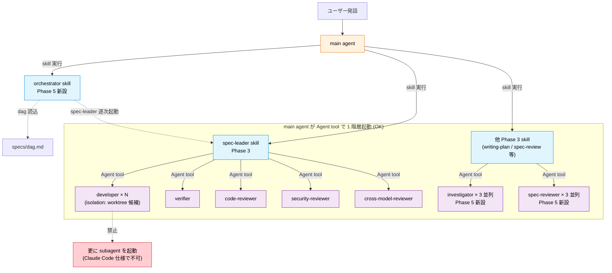
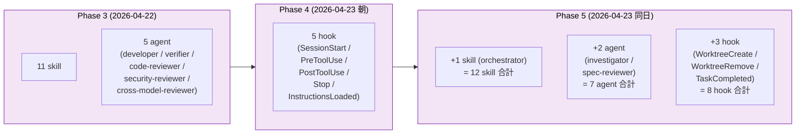

# Phase 5 orchestrator 追加 実装完了レポート

- **Phase 5 着手**: 2026-04-23
- **Phase 5 実質完了**: 2026-04-23 (同日、3 バッチ完走)
- **対象**: `ROADMAP.md` Phase 5 の orchestrator + agent 拡張 + 複数 Spec 並列管理 7 項目

## 0. Agent Teams 有効化について (2026-04-23 追記、Phase 6 着手中に判明)

Phase 5 の設計調査 / ドッグフーディング着手時に、本プロジェクト user settings に Claude Code の **Agent Teams 機能を有効化する環境変数** (`CLAUDE_CODE_EXPERIMENTAL_AGENT_TEAMS=1`) が未設定だったことが判明しました。対応として `~/.claude/settings.json` の `env` セクションに追加しました:

```json
{
  "env": {
    "CLAUDE_CODE_EXPERIMENTAL_AGENT_TEAMS": "1"
  }
}
```

**重要**: この未設定は本 Phase の設計 (orchestrator skill + subagents 多階層禁止対応) には **影響しません**。理由:

- **subagents** (Agent tool / subagent_type 指定): Agent Teams 有効化に関わらず利用可能な機能。Phase 3-5 で使ってきた developer / verifier / reviewer 等の agent 起動はこちらの範疇
- **Agent Teams**: チーム作成 / `/agents` コマンド / 並列 orchestration のためのメタ機能。本プロジェクトの orchestrator skill (main agent が逐次管理) とは別系統

Phase 5 で判明した「Subagents cannot spawn their own subagents」制約は subagents の仕様で、Agent Teams の有無とは独立です。従って orchestrator skill 設計 (Phase 5 バッチ 3 で実施) は現状のまま有効で、Agent Teams 有効化は Phase 6 以降のマルチセッション並列化 / tmux TUI ダッシュボードと連動して活用される想定です。

新セッション起動時に環境変数が反映されます。

## 1. サマリ

Phase 5 で目指した「複数 Spec 並列実行」「investigator / spec-reviewer agent 並列化」「WorktreeCreate/Remove/TaskCompleted hook 連携」を達成。ただし **Phase 5 バッチ 3 で Claude Code 公式仕様「Subagents cannot spawn their own subagents」が判明**、当初の agent 3 階層設計 (orchestrator → spec-leader → workers) は動作不可と確定したため、orchestrator を agent から **skill** に再設計する大きな方針転換を実施しました。

この転換により、Phase 3 で「動作しない場合は state ファイル経由の擬似並列方式」と fallback を明記していた設計予防の価値が証明される形になりました。main agent が orchestrator skill + spec-leader skill を兼任実行し、workers (developer / verifier / reviewer) のみを Agent tool で 1 階層起動する設計に収束、Phase 5 の実装コストを最小化できました。

Phase 5 の達成事項:

- ✅ **orchestrator skill** (agent から skill への設計転換): 複数 Spec DAG 管理 / dependency-order merge / 再開モード / 単一 Spec スキップ
- ✅ **investigator agent**: 3 responsibility 分離 (codebase / other-plans / dependencies)、writing-plan / brainstorming から並列起動可能
- ✅ **spec-reviewer agent**: spec-review skill の 3 観点 (completeness / feasibility / consistency) を独立並列判定
- ✅ **WorktreeCreate hook**: Claude Code 管理 worktree 作成時に Spec/Plan/Review 自動コピー + progress.md 初期化
- ✅ **WorktreeRemove hook**: 削除前の未コミット / archive 未完警告 + progress.md の archive バックアップ
- ✅ **TaskCompleted hook**: Claude Code Task 系連携で worktree 内 progress.md にタスク完了ログ追記
- ✅ **Agent Teams 多階層 subagent 動作検証** (claude-code-guide 経由で公式仕様確認、禁止と判明)
- ✅ **merge 順序制御** (orchestrator skill §4.4、dependency-order 実装)
- ✅ **リソース上限設計** (orchestrator skill §5、Phase 5 は max_parallel=1)
- ⏳ **tmux + TUI ダッシュボード**: Phase 6 で実装予定

## 2. 実装コンポーネント一覧

### 2.1 Phase 5 新規 agent (2 agent、Phase 3 の 5 agent と合わせて 7 agent 体制)

| # | agent | 役割 | 連携元 |
|---|---|---|---|
| 6 | `investigator` | codebase / other-plans / dependencies の 3 responsibility 分離並列調査 | writing-plan / brainstorming |
| 7 | `spec-reviewer` | spec-review skill の 3 観点 (completeness / feasibility / consistency) を並列独立判定 | spec-review skill |

Phase 3 の 5 agent (developer / verifier / code-reviewer / security-reviewer / cross-model-reviewer) と合わせて**合計 7 agent**。

### 2.2 Phase 5 新規 skill (orchestrator、Phase 3 の 11 skill と合わせて 12 skill 体制)

| # | skill | 役割 | 起動元 |
|---|---|---|---|
| 12 | `orchestrator` | 複数 Spec DAG 管理、spec-leader 逐次起動、merge 順序制御、再開モード | main agent (複数 Spec 時に自動) / ユーザー明示起動 |

Phase 3 の 11 skill と合わせて**合計 12 skill**。

### 2.3 Phase 5 新規 hook (3 hook、Phase 4 の 5 hook と合わせて 8 hook 体制)

| # | hook | イベント | 役割 | bypass 環境変数 |
|---|---|---|---|---|
| 6 | worktree-create-init.sh | WorktreeCreate | Claude Code 管理 worktree 作成時に Spec/Plan/Review 自動コピー + progress.md 初期化 | SKIP_WORKTREE_CREATE_HOOK |
| 7 | worktree-remove-check.sh | WorktreeRemove | 削除前の未コミット / archive 未完警告 + progress.md の archive バックアップ | SKIP_WORKTREE_REMOVE_HOOK |
| 8 | task-completed-progress.sh | TaskCompleted | worktree 内 progress.md にタスク完了ログ追記 | SKIP_TASK_COMPLETED_HOOK |

Phase 4 の 5 hook (SessionStart / PreToolUse / PostToolUse / Stop / InstructionsLoaded) と合わせて**合計 8 hook**。

### 2.4 削除 (agent → skill 転換)

- `agents/orchestrator.md` 削除
- `~/.claude/agents/orchestrator.md` symlink 解除
- 代わりに `skills/orchestrator/SKILL.md` 新設 + `~/.claude/skills/orchestrator` symlink 追加

## 3. 重要な設計変更 (agent 3 階層禁止への対応)

### 3.1 判明した制約

Phase 5 バッチ 3 で claude-code-guide 経由の調査により、Claude Code 公式仕様が確認されました:

> **Subagents cannot spawn their own subagents**
>
> 出典: `code.claude.com/docs/en/subagents.md` / `code.claude.com/docs/en/agent-teams.md` / `code.claude.com/docs/en/agent-sdk/subagents`

### 3.2 当初計画と実際の差分

| 項目 | 当初計画 (Phase 5 バッチ 1 設計) | 実際の設計 (バッチ 3 判明後) |
|---|---|---|
| orchestrator | Agent (3 階層: orchestrator → spec-leader → workers) | **Skill** (main agent が実行、1 階層: main → workers) |
| spec-leader | Agent として起動 | main agent 内で skill 実行 (階層なし) |
| developer / verifier / reviewer | 孫 agent として起動 | main agent が Agent tool で 1 階層起動 |
| Agent `isolation: "worktree"` | spec-leader に付与 | workers に付与 (並列 developer の競合対策) |

### 3.3 Phase 3 の fallback 設計が功を奏した

Phase 3 ROADMAP には以下が明記されていました:

> **Agent Teams 多階層 subagent の動作検証**: orchestrator → specLeader → workers の 3 層が動作するか確認
>   - 動作しない場合: state ファイル経由の擬似並列方式に切り替えます

この fallback 設計が Phase 5 で現実のものとなり、**設計転換コストが最小に抑えられた**。orchestrator を skill にすることで、実質的に「main agent が state ファイル (dag.md / progress.json / result.json) を読み書きしながら spec-leader を逐次実行する擬似並列」の形が自然に実現されました。

### 3.4 設計転換の実装インパクト

- `agents/orchestrator.md` (157 行) → `skills/orchestrator/SKILL.md` (228 行) に移植、内容は大幅拡充
- spec-leader は**改修ゼロ** (Phase 3 入出力契約を維持)
- investigator / spec-reviewer は変更なし (1 階層 subagent として動作可)
- workers 5 種も変更なし

## 4. Mermaid 関係図

### 4.1 Phase 5 最終アーキテクチャ (1 階層制約準拠)



### 4.2 Phase 3 → 5 の進化



## 5. 各コンポーネント詳細

### 5.1 orchestrator skill (Phase 5 の中核)

**役割**: main agent が複数 Spec を統括実行する際の標準プロトコル。

**主要機能 (12 章構成)**:

- §3 前提条件 (dag.md + 各 Spec の spec/review/plan 揃い)
- §4.1 DAG 読み込みと並列計画
- §4.2 グループ単位の実行 (Phase 5 は逐次)
- §4.3 監視と次 Spec の解放 (result.json verdict で判定)
- §4.4 merge 順序制御 (dependency-order / completion-order / manual)
- §4.5 orchestration.md 生成 (人間可読)
- §5 リソース上限 (Phase 5 max_parallel=1、Phase 6 でマルチセッション並列化)
- §6 多階層制約への準拠 (公式仕様引用)
- §8 再開モード
- §10 単一 Spec 時の挙動 (skip)
- §11 Phase 3 インタフェース完全依存
- §12 将来の発展 (Phase 6 以降)

**設計の要点**: spec-leader は Phase 3 の入出力契約 (spec_path / progress.json / result.json) に完全依存、本 skill の責務は「DAG を読んで順序を決める」「spec-leader を逐次起動する」「結果を監視する」に集約。

### 5.2 investigator agent

**責務の 3 分離** (`responsibility` パラメータで切替):

- **codebase**: Grep / Glob で既存実装 / 命名規約 / 共有資産を横断調査
- **other-plans**: `specs/*.plan.md` + `specs/archive/*.plan.md` を走査、依存 Spec の共有資産 / API 契約 / データモデルを抽出
- **dependencies**: 依存ライブラリの利用可否 + 脆弱性スキャン (`npm audit` / `pip-audit` / `cargo audit` / `govulncheck`)

**並列起動パターン**: writing-plan skill が 3 つの responsibility を同時並列で Agent tool 起動 (1 階層)、3 つの構造化レポートを統合して Plan §2-4 に反映。

### 5.3 spec-reviewer agent

**3 観点 × 3 並列**:

- `responsibility: "completeness"`: 7 章充足 / frontmatter / 受け入れ基準 / TBD / リスク
- `responsibility: "feasibility"`: 非機能要件達成性 / 技術制約 / 依存関係 / 外部サービス利用可否
- `responsibility: "consistency"`: 他 Spec / archive / コードベース / dag.md 整合性 (Grep / Glob 駆使)

**観点独立性の保証**:
- 他観点の指摘を自身のレポートに混入させない (バイアス防止)
- 他 spec-reviewer agent の結果を参照して判断を変えない (並列独立性)

**統合**: spec-review skill 本体が 3 agent の部分レポートを統合、スコアリング (`overall = 0.4 completeness + 0.3 feasibility + 0.3 consistency`) + verdict 判定 (Phase 3 SKILL.md §7 準拠)。

### 5.4 Phase 5 hook 3 種

#### WorktreeCreate hook

- stdin から worktree path を defensive に取得 (複数フィールド候補試行)
- `git rev-parse --git-common-dir` で main repo を特定
- main 側の specs/<spec>.md / .plan.md / .review.md を `cp` で worktree 内に配置 (iter-5 改修の cp 強制に準拠)
- worktree 内 progress.md を Isolate 完了扱いで初期化
- 動作確認 pass (main repo + 3 fixture で worktree 作成、Spec/Plan/Review + progress.md 全て生成確認)

#### WorktreeRemove hook

- 未コミット変更確認 + archive 移動完了確認
- progress.md を main 側 `specs/archive/<spec>.progress.md` に backup (learn skill 用)
- 警告は stderr、削除の可否は ExitWorktree 側の `discard_changes` に委ねる
- 動作確認 pass (progress.md backup + 未コミット 2 件警告 + archive 未完警告)

#### TaskCompleted hook

- Claude Code Task 系 (TaskUpdate status=completed) 発火時
- worktree 内 (worktrees/ or .claude/worktrees/) かつ progress.md 存在時のみ動作
- progress.md の `## ログ` セクションに `<timestamp> [task-completed] <subject> — <description>` 追記
- frontmatter `updated` も同時更新
- 動作確認 pass (worktree 外通過 / worktree 内追記確認)

## 6. 動作検証結果

### 6.1 Agent Teams 多階層調査 (claude-code-guide 経由)

3 点を公式ドキュメントで確認:

1. **多階層 subagent の可否**: **不可**。"Subagents cannot spawn their own subagents" が公式明記
2. **subagent_type の指定方法**: カスタム agent も指定可、ただし tool 継承は明示的な `tools` フィールド指定が必要、skills / mcpServers も同様
3. **並列実行時のリソース制約**: 上限なし (技術的には)、ただし「3-5 teammates が最適」の公式推奨、トークンコストは線形スケール

### 6.2 Phase 5 hook 3 種の動作確認

| hook | 動作確認 | 結果 |
|---|---|---|
| WorktreeCreate | main repo + 3 fixture で worktree 作成 → hook 起動 | pass (specs/ + plans/ + progress.md 生成確認) |
| WorktreeRemove | 未コミット 2 件 + archive 未完状態で発火 | pass (警告 2 項目 + progress.md backup) |
| TaskCompleted (worktree 外) | status=completed で起動 | pass (通過、何もしない) |
| TaskCompleted (worktree 内) | status=completed で起動 | pass (progress.md にログ追記) |

## 7. Phase 5 で得られた知見

### 7.1 設計予防の価値が証明された

Phase 3 で ROADMAP に「動作しない場合: state ファイル経由の擬似並列方式に切り替えます」と fallback を明記していたことで、Phase 5 で Agent Teams 多階層禁止が判明した時の設計転換コストが最小に抑えられた。**不確実性のある技術前提に fallback を設計しておく** パターンは汎用的に有効。

### 7.2 agent と skill の使い分けの原則

Phase 5 で明確になった原則:

- **skill**: main agent が順次実行するプロトコル / 手順書。状態管理や file I/O を伴う長期動作に適する
- **agent**: main agent が並列 / 独立実行させる単機能処理。短時間完結で結果を呼び出し側にまとめて返す
- **agent の多階層禁止**: skill は skill から呼び出せる (main agent が順次実行)、agent は main agent からしか呼び出せない

orchestrator のような「複数 skill の起動 + 進捗監視」は **skill の役割** であり、agent に分離すると多階層制約で破綻する。

### 7.3 Phase 3 のインタフェース確定設計が Phase 5 で報われた

spec-leader の入出力契約 (spec_path / progress.json / result.json) を Phase 3 時点で確定していたため、orchestrator を agent → skill に変更しても **spec-leader 本体は改修ゼロ** で対応可。インタフェース設計の先行投資が Phase 5 で報われた。

### 7.4 hook と agent の協調設計

WorktreeCreate hook が spec-leader §8 Isolate の手順を自動化することで、Phase 3 の skill は「手順書」として、Phase 4-5 の hook は「自動化エンジン」として役割分担が明確化。skill は人間 / Claude が読む規約、hook はマシンが実行する強制。

## 8. 残課題 (Phase 6 への引き継ぎ)

### 8.1 Phase 6 で実装予定

- **tmux + TUI ダッシュボード**: マルチセッション並列化時の可視化 (claude-scrum-team 参考)
- **マルチセッション並列化**: 各 Spec を独立 Claude Code セッションで並列実行、main session が統括
- **hookify プラグイン有効化**: learn.md が 10-20 Spec 分蓄積された後、蓄積パターンから一括 hook 生成
- **ドッグフーディング**: 本リポジトリ自身の改修を新フローで完走試行、hook の過剰発火 / 見逃しを検証
- **GitHub 公開検討**: ライセンス選定 + 第三者が clone して適用可能な形に整備

### 8.2 orchestrator skill の運用時懸念

- Phase 5 時点では `max_parallel=1` (逐次実行) のため、複数 Spec 実装の時間短縮効果は限定的
- 各 Spec 内の workers 並列化は spec-leader に委ねられる (この部分は Phase 5 でも並列化有効)
- Phase 6 のマルチセッション並列化 (tmux + TUI) で初めて「複数 Spec 同時実装」が実現する

### 8.3 Agent Teams 多階層が将来解禁された場合

Claude Code 側で subagent spawning が解禁された場合、orchestrator skill を agent に移植し直す設計変更は可能:

- `agents/orchestrator.md` を新規作成 (内容は現 skill SKILL.md の大半を移植)
- spec-leader も agent に昇格 (現状は skill)
- main agent は orchestrator agent を起動するだけで 3 階層動作

インタフェースは現 skill と agent 両方で互換に設計されているため、移行コストは中程度で済む見込み。

## 9. コミット履歴 (Phase 5 関連、新しい順)

```
18b69fe Phase 5 バッチ 3: Agent Teams 多階層禁止を判明 → orchestrator を agent から skill に再設計
58e771a Phase 5 バッチ 2: WorktreeCreate/Remove + TaskCompleted hook を実装
2642931 Phase 5 バッチ 1: orchestrator + investigator + spec-reviewer agent を実装
```

3 commit、同日完走 (2026-04-23)。

## 10. 本 Phase の総括

Phase 5 で目指した「複数 Spec 並列実行 + agent 拡張 + hook 連携」に対し、以下を達成:

- ✅ orchestrator skill (agent から転換) + investigator / spec-reviewer agent
- ✅ WorktreeCreate / WorktreeRemove / TaskCompleted hook の 3 種実装
- ✅ Agent Teams 多階層制約の公式確認 + 設計転換 (Phase 3 fallback 設計が発動)
- ✅ Phase 3 spec-leader インタフェースに完全依存 (spec-leader 改修ゼロ)
- ⏳ マルチセッション並列化 (tmux + TUI) は Phase 6 対応

**Phase 3 skill + Phase 4 hook + Phase 5 agent/skill 拡張** の三位一体で、単一 Spec も複数 Spec も扱えるワークフロー基盤が完成しました。Phase 6 (公開検討 + ドッグフーディング + tmux TUI) の着手準備が整っています。

Phase 5 で学んだ最大の教訓: **公式仕様の事前確認を怠らない**、**不確実性には fallback を設計予防として明記する**。この 2 点は Phase 6 以降のプロジェクト運営にも適用されます。

## 11. 関連ドキュメント

- `docs/workflow.md`: ワークフロー定義 (9 ステージ)
- `docs/components-map.md`: skill + agent + hook の全体像 (Mermaid + 使用ツール + worktree 4 系統比較)
- `docs/phase3-completion.md`: Phase 3 完了レポート (skill + agent + eval)
- `docs/phase4-completion.md`: Phase 4 完了レポート (hook 自動化)
- `docs/hookify-setup.md`: hookify 導入ガイド (Phase 6 で有効化予定)
- `ROADMAP.md`: Phase 1-6 の段階的構築計画
- `skills/orchestrator/SKILL.md`: 本 Phase の中核 skill 定義
- `agents/investigator.md`, `agents/spec-reviewer.md`: 本 Phase の新規 agent
- `hooks/worktree-create-init.sh`, `hooks/worktree-remove-check.sh`, `hooks/task-completed-progress.sh`: 本 Phase の新規 hook
