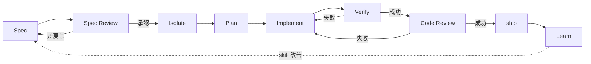

# 開発ワークフロー定義

本プロジェクトで Claude Code を運用する際の標準ワークフローを定義します。複数フレームワーク (superpowers / spec-kit / OpenSpec / claude-scrum-team / BMAD-METHOD 等) の良い部分を取捨選択した独自合成です。

## 設計原則

1. **段階的構築**: 単一 Spec から開始し、複数 Spec 並列対応は後続 Phase で導入します
2. **極力自動化**: Agent Teams を活用し、並列化可能なフェーズはすべて並列実行します
3. **テスト品質担保**: TDD 強制と完了前検証強制を hook で固定化します
4. **階層分離**: orchestrator / specLeader / workers の 3 層に責務を明確に分けます
5. **拡張可能なインタフェース**: Phase 3 時点で「将来 orchestrator から呼ばれる前提」のインタフェースを確定し、Phase 5 で specLeader を改修不要にします

## 階層構造 (3層)

```
orchestrator (Phase 5 で実装)
  ├── specLeader (Spec A 担当)
  │     ├── developer agents (タスク並列)
  │     ├── reviewer agents (code / security / cross-model)
  │     └── verifier agent
  ├── specLeader (Spec B 担当)
  │     └── ...
  └── specLeader (Spec C 担当)
        └── ...
```

### 各層の責務

| 層 | 役割 | 起動主体 | 実装 Phase |
|---|---|---|---|
| **orchestrator** | 複数 Spec の DAG 管理、specLeader 起動、merge 順序制御 | ユーザー / main agent | Phase 5 |
| **specLeader** | worktree 作成、フェーズ遷移制御 (Plan → Implement → Verify → Code Review)、配下 agent 起動、進捗報告 | orchestrator (Phase 5 以降) または main agent (Phase 3) | Phase 3 |
| **workers** (developer / reviewer / verifier) | 単機能タスクの実行 | specLeader | Phase 3 |

### Phase 3 設計方針 (orchestrator 不在前提)

- specLeader は **単独動作可能** に作ります
- 将来 orchestrator から呼ばれる前提のインタフェースを Phase 3 時点で確定します
  - **入力**: spec ファイルパス
  - **出力**: 進捗ファイル + 結果ファイルのパス
- Phase 5 で orchestrator を追加する際、specLeader の改修は不要にします

## ワークフロー全体像



## 各フェーズ詳細

### 1. Spec

**目的**: 軽量 Markdown 形式で要件と仕様を記述します (OpenSpec 流)。

| 項目 | 内容 |
|---|---|
| 担当層 | main agent (対話) |
| 入力 | ユーザーの自然言語要望 |
| 出力 | Spec ファイル (Markdown、main ブランチ側) |
| Agent Teams 活用 | × (対話必須) |
| 品質ゲート | Spec frontmatter (name / description / acceptance criteria) の存在を hook で検証 |

**Spec ファイル配置**: `specs/<spec-name>.md` (worktree 外、main 側で管理)

### 2. Spec Review

**目的**: AI による自動レビュー後、ユーザーが最終承認します (claude-scrum-team の PO 役割と同じ)。

| 項目 | 内容 |
|---|---|
| 担当層 | main agent + reviewer agents |
| 入力 | Spec ファイル |
| 出力 | レビューコメント + 承認ステータス |
| Agent Teams 活用 | ○ (AI reviewer 3 並列: 完全性 / 実現可能性 / 既存仕様との整合性) |
| 品質ゲート | ユーザー承認なしに Isolate へ進めない |

### 3. Isolate

**目的**: Spec 単位で worktree を作成し、main を汚さず実装を進めます。

| 項目 | 内容 |
|---|---|
| 担当層 | specLeader |
| 入力 | 承認済み Spec ファイルパス |
| 出力 | worktree path + ブランチ名 |
| Agent Teams 活用 | × |
| 品質ゲート | worktree 作成成功確認、Spec ファイルが worktree から参照可能であること |

**worktree 命名規則**: `worktrees/<spec-name>/`、ブランチ名 `spec/<spec-name>`

### 4. Plan

**目的**: Spec を技術設計に展開し、タスクに分解します (spec-kit の Plan + Tasks 相当)。

| 項目 | 内容 |
|---|---|
| 担当層 | specLeader + 調査 worker |
| 入力 | Spec ファイル |
| 出力 | Plan ファイル (技術設計 + タスクリスト) |
| Agent Teams 活用 | △ (コードベース調査 / 依存ライブラリ調査 / 類似実装調査を並列実行) |
| 品質ゲート | Plan ファイルにタスク分解 (チェックボックス形式) が含まれること |

**Plan ファイル配置**: worktree 内 `plans/<spec-name>.md`

### 5. Implement

**目的**: TDD でタスクを並列実装します。

| 項目 | 内容 |
|---|---|
| 担当層 | specLeader + developer agents |
| 入力 | Plan ファイル |
| 出力 | 実装コード + テストコード + コミット |
| Agent Teams 活用 | ◎ (タスク単位で developer agent を並列起動) |
| 品質ゲート | PreToolUse hook: 実装ファイル編集前に対応テストの存在を確認、なければブロック |

**TDD 強制**: superpowers の TDD skill 思想を踏襲し、テスト先行を hook で物理的に強制します。

### 6. Verify

**目的**: 全テスト / lint / 型チェック / 手動チェックリストを実行します。

| 項目 | 内容 |
|---|---|
| 担当層 | specLeader + verifier agent |
| 入力 | 実装完了状態の worktree |
| 出力 | 検証レポート (全項目 pass / fail) |
| Agent Teams 活用 | ○ (テスト / lint / 型を並列実行) |
| 品質ゲート | Stop hook: 完了宣言前に「全テスト緑 + lint 通過 + 型通過」を強制 |

**verification-before-completion skill** が Stop hook と連動し、検証コマンド未実行ならブロックします。

### 7. Code Review

**目的**: code / security / cross-model の独立レビューを並列実行します。

| 項目 | 内容 |
|---|---|
| 担当層 | specLeader + reviewer agents |
| 入力 | Verify 通過済み worktree |
| 出力 | レビューコメント + 承認ステータス |
| Agent Teams 活用 | ◎ (code-reviewer / security-reviewer / cross-model-reviewer の 3 並列) |
| 品質ゲート | 全 reviewer 承認 + ユーザー最終承認なしに ship 不可 |

**cross-model-review**: Codex 等の他モデルによる独立審査 (claude-scrum-team 参考)。

### 8. ship

**目的**: worktree を main にマージし、worktree を削除します。

| 項目 | 内容 |
|---|---|
| 担当層 | specLeader (Phase 3) → orchestrator (Phase 5、merge 順序制御込み) |
| 入力 | Code Review 通過済み worktree |
| 出力 | main へのマージコミット + worktree 削除 |
| Agent Teams 活用 | × |
| 品質ゲート | merge 後に main で再度テスト実行 |

### 9. Learn

**目的**: 振り返りを実施し、skill / hook / ワークフロー自体を改善します。

| 項目 | 内容 |
|---|---|
| 担当層 | main agent + ユーザー |
| 入力 | ship 完了状態 + 当該サイクルの記録 |
| 出力 | 改善提案 + skill / hook 修正コミット |
| Agent Teams 活用 | × |
| 品質ゲート | なし (改善提案は次サイクル以降に反映) |

## skill / agent / hook 配置一覧

### skill (Phase 3 で作成)

| skill 名 | 役割 | 担当フェーズ | 参考 |
|---|---|---|---|
| `brainstorming` | Spec 前の要件深掘り (任意起動) | (Spec 前段) | superpowers |
| `writing-spec` | 軽量 Markdown 仕様作成 | Spec | OpenSpec |
| `spec-review` | AI 自動 Spec レビュー | Spec Review | claude-scrum-team |
| `spec-leader` | フェーズ遷移制御 (Isolate → Code Review) | Isolate〜Code Review | 独自 |
| `writing-plan` | 技術計画 + タスク分解 | Plan | superpowers + spec-kit |
| `tdd-driver` | テスト先行強制 | Implement | superpowers |
| `verification-before-completion` | 完了前検証強制 | Verify | superpowers |
| `receiving-code-review` | レビュー指摘対応 | Code Review (差戻し時) | superpowers |
| `cross-model-review` | 独立モデルレビュー | Code Review | claude-scrum-team |
| `learn` | 振り返り + 改善提案 | Learn | 独自 |

### agent (Phase 3 で作成)

| agent 名 | 役割 | 起動主体 |
|---|---|---|
| `developer` | タスク単位の TDD 実装 | specLeader |
| `code-reviewer` | コード品質レビュー | specLeader |
| `security-reviewer` | セキュリティ観点レビュー | specLeader |
| `cross-model-reviewer` | 他モデル (Codex 等) 経由のレビュー | specLeader |
| `verifier` | 全検証 (test / lint / type) 実行 | specLeader |
| `spec-reviewer` | Spec の完全性 / 実現可能性 / 整合性レビュー | main agent |
| `investigator` | コードベース / 依存 / 類似実装の調査 | specLeader (Plan フェーズ) |
| `orchestrator` | 複数 Spec の DAG 管理 (Phase 5) | main agent / ユーザー |

### hook (Phase 4 で実装)

| hook event | 用途 | 連動 skill |
|---|---|---|
| `SessionStart` | プロジェクト固有 skill / コンテキスト注入 | (全般) |
| `InstructionsLoaded` | CLAUDE.md / Spec ファイルロード時の追加コンテキスト | `writing-spec` |
| `PreToolUse` (Edit/Write) | TDD 強制 (実装前にテスト存在確認) | `tdd-driver` |
| `PostToolUse` (Edit/Write) | テストファイル変更時の自動テスト実行 | `tdd-driver` |
| `WorktreeCreate` | worktree 初期化 (Spec ファイルコピー、ブランチ確認) | `spec-leader` |
| `WorktreeRemove` | worktree 削除前の未コミット警告 | `spec-leader` |
| `Stop` | 完了宣言前の全検証強制 | `verification-before-completion` |
| `TaskCompleted` | タスク完了時に進捗ファイル更新 | `spec-leader` |

## 技術的不確実性と検証計画

### Agent Teams の多階層 subagent サポート

Phase 5 で orchestrator → specLeader → workers の 3 層構造を実装する際、Claude Code の Agent Teams が「subagent of subagent」をサポートするか未確認です。

**Phase 5 での検証項目**:
1. specLeader 自身が subagent として起動された状態で、配下に developer agent を起動できるか
2. 階層間の進捗通知 (specLeader → orchestrator) の実現方法
3. 並列起動時のリソース上限 (同時起動可能 agent 数)

**代替案**: 多階層 subagent が動作しない場合、orchestrator は state ファイル経由で specLeader を順次起動する擬似並列方式に切り替えます。

### worktree 操作の自動化レベル

`WorktreeCreate` / `WorktreeRemove` hook の挙動は本プロジェクト着手時点で未検証です。Phase 4 で挙動を確認し、必要に応じて command hook で代替実装します。

## Phase 別実装計画

### Phase 2 (現在): ワークフロー骨子定義

- [x] `docs/workflow.md` 作成 (本ドキュメント)
- [ ] `ROADMAP.md` 再構成 (Phase 2-6)

### Phase 3: 単一 Spec 版 skill 実装

- [ ] 10 skill (brainstorming / writing-spec / spec-review / spec-leader / writing-plan / tdd-driver / verification-before-completion / receiving-code-review / cross-model-review / learn)
- [ ] 8 agent (developer / code-reviewer / security-reviewer / cross-model-reviewer / verifier / spec-reviewer / investigator / orchestrator は Phase 5)
- [ ] specLeader は単独動作可能 (orchestrator 不在前提)
- [ ] orchestrator から呼ばれる前提のインタフェース定義

### Phase 4: hook 自動化

- [ ] TDD 強制 hook (PreToolUse Edit/Write)
- [ ] verification 強制 hook (Stop)
- [ ] worktree 自動化 hook (WorktreeCreate / WorktreeRemove)
- [ ] SessionStart hook による skill 注入

### Phase 5: orchestrator 追加 (複数 Spec 並列)

- [ ] orchestrator agent 実装
- [ ] DAG 管理 (Spec 間依存関係)
- [ ] Agent Teams 多階層 subagent の動作検証
- [ ] merge 順序制御
- [ ] 並列実行時のコンフリクト解決戦略

### Phase 6: 統合改善ループ + 公開検討

- [ ] 全フェーズの統合テスト
- [ ] skill-creator による各 skill の eval iteration
- [ ] memory 運用最適化
- [ ] 公開検討 (任意)

## 参考フレームワークと採用箇所

| フレームワーク | 採用箇所 |
|---|---|
| **superpowers** | skill 相互参照、TDD 強制、verification 強制、SessionStart hook、receiving-code-review |
| **OpenSpec** | 軽量 Markdown 仕様、Spec の状態管理 (propose / apply / archive 相当) |
| **spec-kit** | Plan フェーズの設計 + タスク分解パターン |
| **claude-scrum-team** | Spec Review (PO 役割)、cross-model review、phase gate hook、tmux + TUI 検討 (Phase 6) |
| **BMAD-METHOD** | role-based agent 階層 (orchestrator / specLeader / workers) |
| **gstack** | 役割分離の粒度感 |
| **oh-my-claudecode** | Agent Teams 活用パターン (Phase 5) |
| **skill-creator** | 各 skill の eval ループ (Phase 6) |
| **hookify** | hook 自動生成 (Phase 4) |
