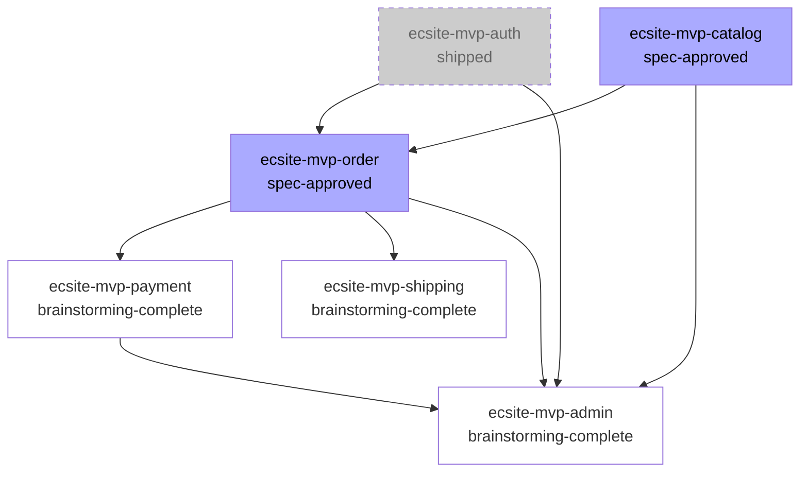

# Spec DAG Builder Skill

複数の Spec (Brainstorming ノートまたは Spec ファイル) の依存関係を解析し、DAG (有向非巡回グラフ) を構築します。Phase 5 で実装される orchestrator agent が複数 specLeader を起動順序通りに呼び出すための入力データを生成することが主な役割です。

**用語**: 「Project Phase」「Workflow Stage (ステージ)」「Release Phase」「Spec」の定義は `docs/glossary.md` を参照してください。

## 1. 役割と位置づけ

本 skill は本プロジェクトのワークフロー (`docs/workflow.md`) における **DAG 構築ステージ** を担います。位置づけ:

```
Brainstorming → [DAG 構築 (本 skill)] → Spec Review → Isolate → Plan → Implement → Verify → Code Review → ship → Learn
                                              ↑
                                              再起動
```

本 skill は **段階的アップデート** 方式で動作します。各 Spec の `status` を見て、必要な精度の DAG を生成します。複数回起動して問題ありません (起動するたびに最新状態の DAG に更新されます)。

## 2. 起動トリガー

以下のフレーズで自動的に起動してください。

- 「DAG 作って」「DAG 構築して」
- 「依存関係整理して」「依存関係見せて」
- 「分割した Spec の順序決めて」
- 「並列グループ知りたい」「並列実行できるか確認したい」
- 「Spec の実行順序を整理したい」

また、以下の状況で **自動起動を提案** してください (将来 hook 化検討)。

- `specs/` 配下に `*.brainstorm.md` または `*.md` が **2 つ以上** 存在し、`specs/dag.md` が未作成
- 既存 `specs/dag.md` があるが、`*.brainstorm.md` / `*.md` の更新時刻が `specs/dag.md` より新しい (= DAG が古い)

## 3. 入力ファイルの収集

skill 起動直後、以下を実施してください。

1. `Glob` で `specs/*.brainstorm.md` と `specs/*.md` を取得 (`specs/dag.md` は除外)
2. 各ファイルの frontmatter を読み取り、以下を取得
   - `name` (必須)
   - `status` (必須、後述の値リストのいずれか)
   - `depends_on` (任意、配列、未設定なら `[]` 扱い)
   - `parallel_group` (任意、本 skill が算出して上書き)
3. 各ファイルの「目的」「制約」「スコープ」「Spec 間で共有する資産」「切り出した理由」「未解決事項」セクションを読み取り、依存関係の推測材料とする
4. 既存の `specs/dag.md` がある場合は読み込み、前回の DAG と差分を比較

入力ファイルが **0 件** の場合は「specs/ 配下にノート / Spec が存在しません」と返して終了。

**1 件のみ** の場合も **1 ノード DAG** を `specs/dag.md` に生成します (2026-04-22 改修、フロー分岐削除のため)。下流 skill (writing-spec / writing-plan / spec-leader) は常に dag.md を参照して処理する設計となったため、単一 Spec でも DAG を用意する必要があります。

### 1 ノード DAG のテンプレート

```markdown
---
generated: <YYYY-MM-DD>
source: brainstorming | spec-review
specs: [<spec-name>]
---

# Spec DAG

## 依存関係グラフ

\`\`\`mermaid
graph TD
  single[<spec-name><br/>parallel_group: 1]
\`\`\`

## 並列実行グループ

| parallel_group | Spec | 依存 |
|---|---|---|
| 1 | <spec-name> | (なし) |

## 推奨実行順序

1. Group 1: <spec-name>
```

単一 Spec の場合は暫定 / 確定の区別は不要 (内容が同一) です。1 回目の起動で生成し、2 回目 (spec-review 後) も同じ内容で再生成するだけです。

## 4. status フィールド

各 Spec の frontmatter `status` フィールドは以下のいずれかの値を取ります。

| status 値 | 意味 | DAG 表示 | orchestrator 扱い |
|---|---|---|---|
| `brainstorming` | Brainstorming ステージ進行中 | 白 (実線) | 起動対象外 |
| `brainstorming-complete` | Brainstorming 完了、Spec ステージ未着手 | 白 (実線) | 起動対象外 |
| `spec-writing` | Spec ステージ進行中 | 白 (実線) | 起動対象外 |
| `spec-approved` | Spec Review 通過、起動可能 | 青 (実線) | **起動候補** |
| `in-progress` | Plan / Implement / Verify / Code Review 中 | 黄 (実線) | 待機 (完了待ち) |
| `shipped` | ship 完了 | グレー (点線) | スキップ (依存元として残す) |
| `archived` | 古い・参照のみ | 灰 (除外可) | DAG から除外候補 |

`status` が未設定または不正な値の場合、ユーザーに確認して修正してください。skill 側で勝手に補完しないでください。

## 5. 段階的アップデート (動作モード)

各 Spec の `status` 分布によって、本 skill は自動的に動作モードを切り替えます。

### 5.1 暫定 DAG モード (全 Spec が `brainstorming-complete` 以下)

すべての入力 Spec の `status` が `brainstorming` または `brainstorming-complete` または `spec-writing` の場合、Brainstorming ノートの内容のみで DAG を構築します。

- 依存関係は粗く、Spec ステージで詳細が判明したら変わる可能性あり
- `specs/dag.md` の冒頭に **警告メッセージ** を必ず含める
  ```
  ⚠️ 暫定 DAG: 全 Spec が Brainstorming 段階のため、依存関係は粗い推測に基づきます。
  各 Spec が spec-approved になった時点で本 skill を再実行し、確定 DAG に更新してください。
  ```
- orchestrator は本 DAG を「初期起動順序の参考」として使用し、確定 DAG で上書きする前提

### 5.2 部分確定 DAG モード (一部 Spec が `spec-approved` 以上)

一部の Spec が `spec-approved` / `in-progress` / `shipped` の場合、確定済 Spec は詳細依存関係、未確定 Spec は暫定依存関係で DAG を構築します。

- `specs/dag.md` の冒頭に **部分確定マーク** を含める
  ```
  ℹ️ 部分確定 DAG: N 件中 M 件が spec-approved 以上で確定済み、残りは暫定依存関係です。
  全 Spec が spec-approved 以上になった時点で本 skill を再実行してください。
  ```
- 確定済 Spec と未確定 Spec を Mermaid 上で視覚的に区別

### 5.3 完全確定 DAG モード (全 Spec が `spec-approved` 以上)

すべての入力 Spec の `status` が `spec-approved` または `in-progress` または `shipped` の場合、完全確定 DAG を構築します。

- 警告メッセージなし
- orchestrator はこの DAG をそのまま使用可能

## 6. 依存関係の自動推測

各 Spec の frontmatter `depends_on` が未設定または空の場合、ノート / Spec 本文から依存関係を推測します。推測ロジック:

### 6.1 推測材料 (優先度順)

1. **「Spec 間で共有する資産」セクション** (Brainstorming セクション 10.5 参照)
   - 共有資産を提供する Spec → 共有資産を利用する Spec の依存
2. **「切り出した理由」セクション** (Brainstorming セクション 10.5 参照)
   - 「認証は決済より先に必要」等の明示的な前後関係
3. **「制約」「未解決事項」「目的」セクション**
   - 「既存の X を利用する」「Y モジュールに依存する」等の言及
4. **Spec 名のパターンマッチ**
   - 命名規則 (`<project>-<release-phase>-<feature>`) から Release Phase 順序を推測 (`mvp` → `phase2` → `phase3`)
5. **本文中の他 Spec 名への明示的言及**
   - 他 Spec を `depends_on: [other-spec-name]` 形式で示唆している場合

### 6.2 推測の限界

自動推測には限界があります。以下の場合は推測せず、ユーザーに確認してください。

- 双方向に依存しうる関係 (例: 認証 ↔ 管理画面)
- 暗黙的な技術依存 (DB スキーマ共有、共通ライブラリ依存等)
- 同一フィーチャーチームによる開発上の依存 (技術ではなく人的依存)

## 7. 対話確認

推測結果を **必ず** ユーザーに表で提示し、確認を求めてください。自動で `depends_on` を書き込まないでください。

```
推測した依存関係を確認してください:

| Spec | 推測した depends_on | 推測根拠 |
|---|---|---|
| ecsite-mvp-auth | [] | 依存先なし (基盤機能) |
| ecsite-mvp-catalog | [] | 依存先なし (独立機能) |
| ecsite-mvp-order | [ecsite-mvp-auth, ecsite-mvp-catalog] | 「認証されたユーザーが商品を注文」(目的セクションより) |
| ecsite-mvp-payment | [ecsite-mvp-order] | 「注文確定後に決済」(切り出した理由より) |

修正があれば指示してください (例: 「auth と catalog は並列で OK、payment は order と auth 両方に依存」)。
問題なければ「OK」または「この通り進めて」と答えてください。
```

ユーザー承認後、各 Spec の frontmatter に `depends_on` を追記してください。

## 8. parallel_group の算出

`depends_on` が確定したら、トポロジカルソート + 同レベル並列化で `parallel_group` 番号を算出します。

### 8.1 算出ルール

- 依存先がない Spec → `parallel_group: 1`
- 依存先がある Spec → `parallel_group: max(各依存先の parallel_group) + 1`
- 同じ `parallel_group` の Spec は並列実行可能

### 8.2 算出例

```
auth     (depends_on: [])                              → parallel_group: 1
catalog  (depends_on: [])                              → parallel_group: 1
order    (depends_on: [auth, catalog])                 → parallel_group: 2
payment  (depends_on: [order])                         → parallel_group: 3
shipping (depends_on: [order])                         → parallel_group: 3
admin    (depends_on: [auth, catalog, order, payment]) → parallel_group: 4
```

算出後、各 Spec の frontmatter に `parallel_group` を追記してください。

## 9. specs/dag.md の生成

依存関係と並列グループが確定したら、`specs/dag.md` を以下のフォーマットで生成します。

````markdown
---
generated_at: YYYY-MM-DD
spec_count: 6
parallel_groups: 4
mode: partial-confirmed
---

# Spec DAG

[ここに動作モードに応じた警告 / 部分確定マークを挿入]

## Mermaid 図



## 並列実行グループ

| グループ | Spec | status | 前提 |
|---|---|---|---|
| 1 | ecsite-mvp-auth, ecsite-mvp-catalog | shipped, spec-approved | なし |
| 2 | ecsite-mvp-order | spec-approved | グループ 1 完了 |
| 3 | ecsite-mvp-payment, ecsite-mvp-shipping | brainstorming-complete | グループ 2 完了 |
| 4 | ecsite-mvp-admin | brainstorming-complete | グループ 1〜3 完了 |

## 推奨実行順序

orchestrator は以下の順序で specLeader を起動します。

1. グループ 1: ecsite-mvp-auth (shipped, スキップ) + ecsite-mvp-catalog (起動)
2. グループ 2: ecsite-mvp-order (グループ 1 完了後、起動)
3. グループ 3: ecsite-mvp-payment + ecsite-mvp-shipping (グループ 2 完了後、並列起動) ※ Spec ステージ未完了のため、起動前に再 DAG 構築が必要
4. グループ 4: ecsite-mvp-admin (グループ 3 完了後、起動) ※ 同上
````

## 10. 循環依存検出

`depends_on` を確定する前後で循環 (cycle) を検出してください。検出方法は深さ優先探索 (DFS) で訪問中フラグを使う標準アルゴリズムを使用します。

### 10.1 検出時の挙動

循環を検出した場合、自動修正せず、以下のメッセージを表示してユーザー判断を仰ぎます。

```
❌ 循環依存を検出しました:

  ecsite-mvp-auth → ecsite-mvp-session → ecsite-mvp-auth

修正方法 (3 案):
  A. いずれかの Spec のスコープを縮小し、循環の原因となっている要素を別 Spec に切り出す
     (例: session の認証部分を auth に統合)
  B. depends_on を手動修正 (どちらか片方の依存を削除)
     (例: session の depends_on から auth を削除し、認証チェックを各エンドポイントで行う)
  C. 2 つの Spec を統合して 1 つにする
     (例: ecsite-mvp-auth-session として統合)

どの方法で進めますか?
```

ユーザーが選んだ修正方法に従い、対応する Spec のスコープ変更 / `depends_on` 修正 / 統合を行ってください。修正後、再度本 skill を実行して循環が解消されたことを確認します。

### 10.2 多重循環

複数の循環が検出された場合、すべて列挙してください (1 つずつ修正していくと別の循環が露呈する可能性があるため、最初から全体像を提示)。

## 11. 失敗時の対応

以下の状況では、無理に DAG を生成せずユーザーに相談してください。

- **入力ファイル不足**: `specs/` が空、または 1 件のみ
  → 「DAG 構築は不要です」と返して終了
- **status 未設定 / 不正値**: いずれかの Spec の `status` が未設定または不正
  → ユーザーに修正を促す (skill 側で補完しない)
- **推測不能**: 自動推測で根拠が薄い場合
  → 「依存関係を推測できませんでした。手動で `depends_on` を指定してください」とユーザー入力を求める
- **循環解消不能**: ユーザーが選んだ修正方法を試しても循環が残る
  → 全 Spec のスコープを再検討するため、Brainstorming ステージへの差し戻しを提案

## 12. Phase 5 (orchestrator) との連携

本 skill が生成する `specs/dag.md` と各 Spec の `depends_on` / `parallel_group` / `status` が、Phase 5 で実装される orchestrator agent の **唯一の入力データ** です。

orchestrator は以下の流れで動作する想定です (本 skill の出力形式と整合する設計)。

1. `specs/dag.md` を読み込み、並列実行グループと推奨実行順序を取得
2. グループ番号順に処理:
   - `status: shipped` の Spec はスキップ
   - `status: in-progress` の Spec は完了を待機
   - `status: spec-approved` の Spec を specLeader として並列起動
   - グループ内全 Spec の完了を待ってから次グループへ
3. 各グループ完了時に本 skill を再実行 (`status` 更新を反映した DAG 再生成)

そのため、本 skill の出力フォーマット (`specs/dag.md` の構造、frontmatter フィールド名) を変更する場合は、orchestrator 側との整合性を必ず確認してください。

## 13. 失敗・障害事例 (アンチパターン)

以下を行ってはいけません。

- ❌ ユーザー承認なしに `depends_on` を Spec の frontmatter に書き込む
- ❌ 循環依存を勝手に修正する (ユーザーの意図を反映できない)
- ❌ `status` が未設定の Spec を勝手に補完する
- ❌ `specs/dag.md` の警告メッセージを省略する (動作モードに応じた警告は必須)
- ❌ 推測根拠を示さずに `depends_on` を提案する (ユーザーが判断できない)
- ❌ 単一 Spec の場合に DAG 生成をスキップする (2026-04-22 改修で 1 ノード DAG 生成必須化、下流 skill が dag.md を常に参照する前提)
