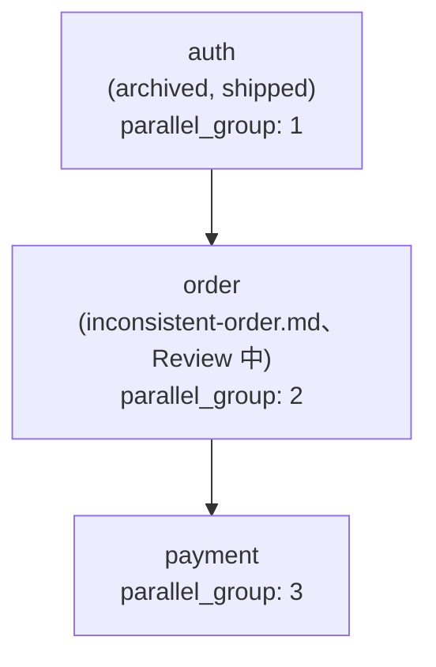

# Spec DAG

## 依存関係グラフ

## 並列実行グループ

| parallel_group | Spec | 依存 |
|---|---|---|
| 1 | auth (archived) | (なし) |
| 2 | order (inconsistent-order) | auth |
| 3 | payment | order |

## 備考

- auth は既に ship 済み。order / payment は auth の共有資産 (User モデル、requireAuth、`/api/auth/*` 名前空間、Cookie 名 `session`) を再利用する前提
- order の新版 (inconsistent-order.md) は spec-review で整合性観点の審査中
