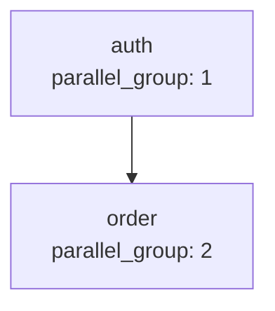

# Spec DAG

## 依存関係グラフ

```mermaid
graph TD
  auth[auth<br/>parallel_group: 1]
  order[order<br/>parallel_group: 2]
  auth --> order
```

## 並列実行グループ

| parallel_group | Spec | 依存 |
|---|---|---|
| 1 | auth | (なし) |
| 2 | order | auth |

## 推奨実行順序

1. Group 1: auth
2. Group 2: order (auth の Plan 参照可)
