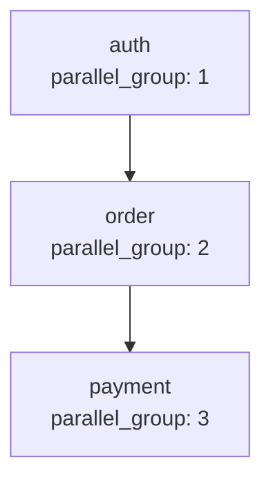

# Spec DAG

## 依存関係グラフ

## 並列実行グループ

| parallel_group | Spec | 依存 |
|---|---|---|
| 1 | auth | (なし) |
| 2 | order | auth |
| 3 | payment | order |

## 推奨実行順序

1. **Group 1** (並列実行可): auth
2. **Group 2** (Group 1 完了後): order
3. **Group 3** (Group 2 完了後): payment

## 備考

- 本 DAG は Brainstorming ノート段階で構築。Spec ステージ完了後に再生成する
- writing-spec skill は本ファイルを **読み取り専用** で扱い、書き換えは行わない (更新は spec-dag-builder の責務)
