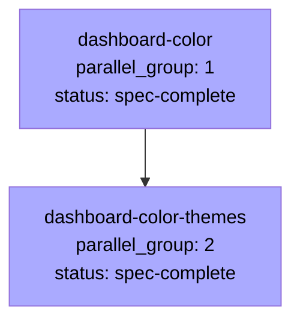

# Spec DAG

Phase 6 バッチ 2 (c) 複数 Spec 並列実行検証のための 2 ノード DAG です。下流 skill (orchestrator / writing-plan / spec-leader) は本ファイルを唯一の実行順序源として参照します。

## 依存関係グラフ

## 並列実行グループ

| parallel_group | Spec | status | 依存 |
|---|---|---|---|
| 1 | dashboard-color | spec-complete | (なし) |
| 2 | dashboard-color-themes | spec-complete | dashboard-color |

## 推奨実行順序

1. Group 1: dashboard-color (writing-plan → spec-leader 起動対象、ship 後に Group 2 へ)
2. Group 2: dashboard-color-themes (writing-plan が `specs/archive/dashboard-color.plan.md` を `references_other_plans` で参照、その後 spec-leader 起動)

## 並列実行の制約

Phase 3 / Phase 5 の現行設計では `max_parallel=1` (orchestrator skill §5) のため、本 DAG は逐次実行されます。Agent Teams の「Subagents cannot spawn their own subagents」制約により、main agent が orchestrator skill + spec-leader skill + workers を兼任する 1 階層構造です。parallel_group が異なる 2 Spec は依存関係上も逐次のため、本 DAG は実質的に sequential です。

同一 parallel_group 内に複数 Spec があるケース (ecsite-mvp-auth + ecsite-mvp-catalog など、独立 Spec) でも Phase 3 では逐次実行します。Phase 6 以降のマルチセッション並列化 (ROADMAP Phase 5 §95) で真の並列が検討されます。
