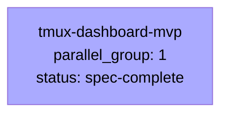

# Spec DAG

単一 Spec のため、1 ノード DAG を生成しています。下流 skill (writing-plan / spec-leader) は本ファイルを参照して処理します。

## 依存関係グラフ

## 並列実行グループ

| parallel_group | Spec | status | 依存 |
|---|---|---|---|
| 1 | tmux-dashboard-mvp | spec-complete | (なし) |

## 推奨実行順序

1. Group 1: tmux-dashboard-mvp (writing-plan → spec-leader 起動対象)
